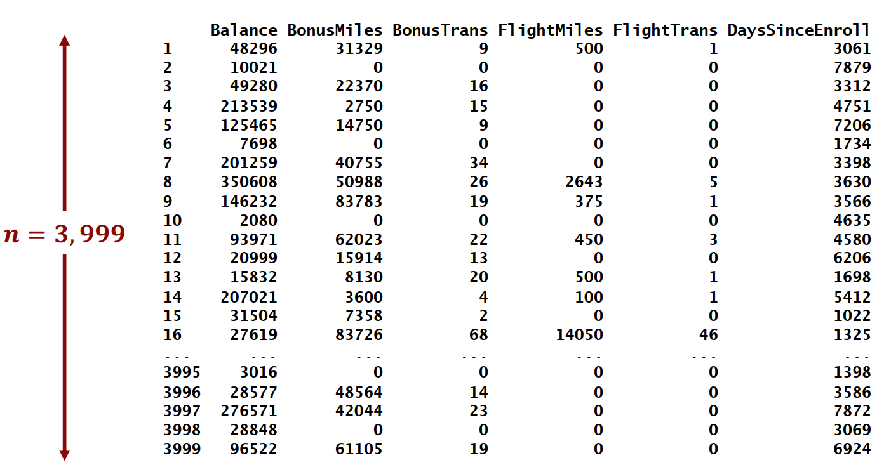
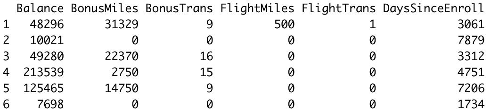
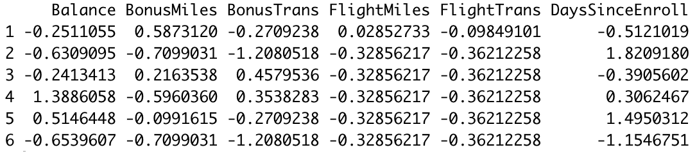
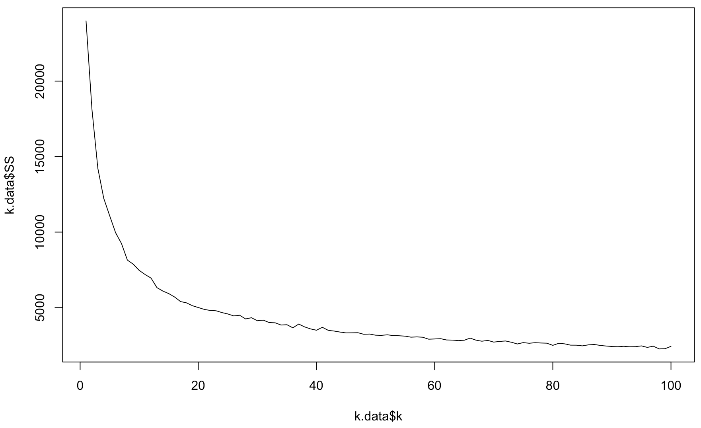
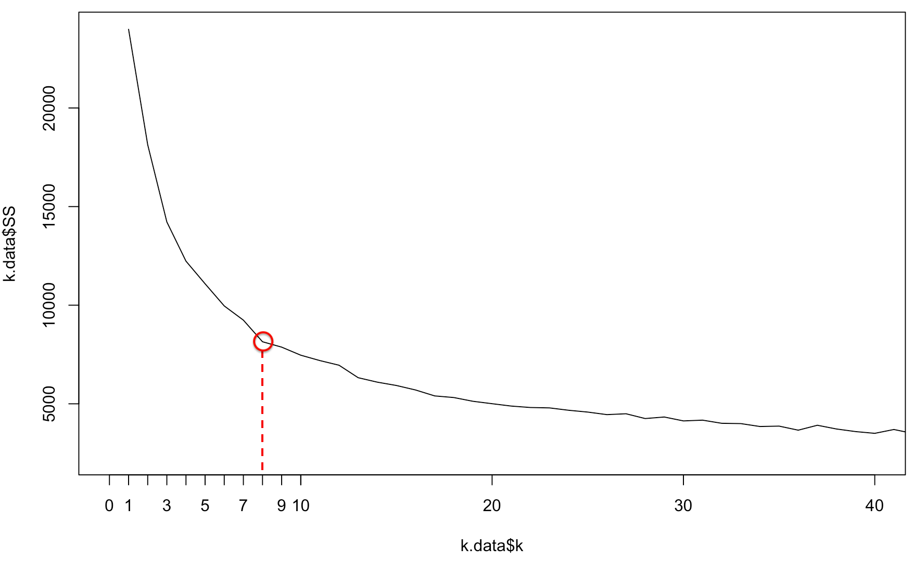
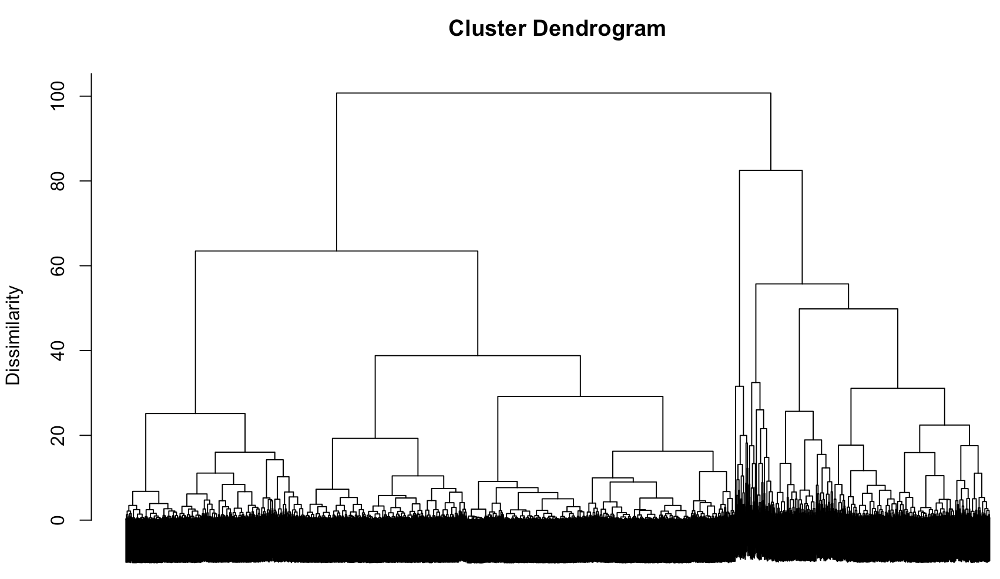
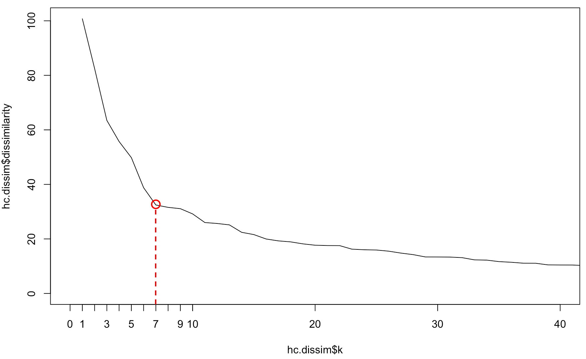
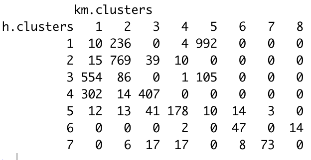

# Customer Segmentation
1. Data exploration and preprocessing
2. K-Means clustering
3. Hierarchical clustering
4. Potential targeted marketing based on clusters
<br/><br/>

## 1. Data exploration and preprocessing
Data on 3,999 customers obtained from the loyalty program of a former airline.

Six numerical values describing customers:
- **Balance**: Number of miles eligible for award travel
- **BonusTrans**: Number of non-flight bonus transactions in the past 12 months
- **BonusMiles**: Number of miles earned from those transactions
- **FlightTrans**: Number of flight transactions
- **FlightMiles**: Number of miles earned from those transactions
- **DaysSinceEnroll**: Tenure in the program (days)

<p align='center'>

</p>

### Data preprocessing (scaling)
- First, 'center' the data by substracting the mean to each column (mean becomes 0 for each column)
- Then, 'scale' the data by dividing by the standard deviation (standard deviation becomes 1 for each column)

```bash
#step 1: create the pre-processor using preProcess
# normalization for each col: (X_i-mean)/std
pp <- preProcess(airline, method=c("center", "scale"))
class(pp)
pp
pp$mean

#step 2: apply it to the dataset
airline.scaled <- predict(pp, airline)

# Sanity check
# mean is (approximately) 0 for all columns.
colMeans(airline)
colMeans(airline.scaled)
apply(airline.scaled,2,sd)
```

|**Original**|
|:--|
||

|**Scaled**|
|:--|
||
<br/>

## 2. K-Means clustering

K-means has a random start where the centroids are initially randomly located. Then iterate the following two steps, until convergence:
- Assign each observation to the nearest centroid
- Recalculate centroids as average of assigned observations
 

```bash
# The kmeans function creates the clusters
# set the number of k=8
km <- kmeans(airline.scaled, centers = 8, iter.max=100) 
# centers randomly selected from rows of airline.scaled

class(km) # class: kmeans
names(km)

# cluster centroids. Store this result
km.centroids <- km$centers
km.centroids
# cluster for each point. Store this result.
km.clusters <- km$cluster
km.clusters

# the sum of the squared distances of each observation from its cluster centroid => cluster dissimilarity
km$tot.withinss  # cluster dissimilarity

# the number of observations in each cluster
km.size <- km$size
km.size
```

### Scree plot for k-means

For k-means, try many value of k and look at their dissimilarity; here, let's test all k from 1 to 100.

```bash
k.data <- data.frame(k = 1:100)
k.data$SS <- sapply(k.data$k, function(k) {
  kmeans(airline.scaled, iter.max=100, k)$tot.withinss
})

# Plot the scree plot.
plot(k.data$k, k.data$SS, type="l")
plot(k.data$k, k.data$SS, type="l", xlim=c(0,40))
axis(side = 1, at = 1:10)
```



Let's zoom on the smallest k values (1-40) to take a closer look.

To select a "good" k value, pick something that defines the corner / pivot in the L (knee). Here, k=8 seems to be a good pick.


<br /><br />

## 3. Hierarchical Clustering
Compute all-pair euclidian distances between the observations. It initially start with as many clusters as data points(here, 3,999). Then, iteratively combine the pair of clusters with the smallest dissimilarity ("close" to each other) until the number of clusters goes down to 1.


```bash
d <- dist(airline.scaled) # method = "euclidean"
class(d)

# Creates the Hierarchical clustering
hclust.mod <- hclust(d, method="ward.D2")

# The "method=ward.D2" indicates the criterion to select the pair of clusters to be merged at each iteration

# Now, plot the hierarchy structure (dendrogram)
# labels=F (false) to not print text for each of the 3999 observations
plot(hclust.mod, labels=F, ylab="Dissimilarity", xlab = "", sub = "")
```


### Scree Plot
Create the scree plot: dissimilarity for each k.

```bash
hc.dissim <- data.frame(k = seq_along(hclust.mod$height),   # index: 1,2,...,length(hclust.mod$height)
                        dissimilarity = rev(hclust.mod$height)) # reverse elements
head(hc.dissim)

# Scree plot
plot(hc.dissim$k, hc.dissim$dissimilarity, type="l")

# Let's zoom on the smallest k values:
plot(hc.dissim$k, hc.dissim$dissimilarity, type="l", xlim=c(0,40))
axis(side = 1, at = 1:10)
```



As discussed above, k=7 seems to be a good pick.

```bash
# Improvement in dissimilarity for increasing number of clusters
hc.dissim.dif = head(hc.dissim,-1)-tail(hc.dissim,-1)
head(hc.dissim.dif,10)

# construct the clusters with k=7
h.clusters <- cutree(hclust.mod, 7)
h.clusters

# The *centroid* for a cluster is the mean value of all points in the cluster: 
aggregate(airline.scaled, by=list(h.clusters), mean) # Compute centroids

# *size* of each cluster
table(h.clusters)

# many zeros mean clusters from kmeans and hierarchical "match up"
table(h.clusters, km.clusters)
```



<br />
<br />

## Potential targeted marketing options

### K-Means Clusters
<table>
  <tr>
    <td rowspan='2' align='center'> <b> Original variables </b></td>
    <td colspan='8' align='center'><b>Clusters</b></td>
  </tr>
  <tr align='center'>
    <td>1</td>
    <td>2</td>
    <td>3</td>
    <td>4</td>
    <td>5</td>
    <td>6</td>
    <td>7</td>
    <td>8</td>
  </tr>
  <tr align='center'>
    <td>Balance</td>
    <td>61,201</td>
    <td>57,207</td>
    <td>127,761</td>
    <td>0.18</td>
    <td>31,165</td>
    <td>61,201</td>
    <td>127,</td>
    <td>0.95</td>
  </tr>
  <tr align='center'>
    <td>BonusMiles</td>
    <td>19,073</td>
    <td>7,565</td>
    <td>58,156</td>
    <td>-0.03</td>
    <td>2,308</td>
    <td>1.11</td>
    <td>1.47</td>
    <td>1.21</td>
  </tr>
  <tr align='center'>
    <td>BonusTrans</td>
    <td>17</td>
    <td>8</td>
    <td>21</td>
    <td>0.55</td>
    <td>3</td>
    <td>2.20</td>
    <td>0.79</td>
    <td>3.31</td>
  </tr>
  <tr align='center'>
    <td>FlightMiles</td>
    <td>118</td>
    <td>147</td>
    <td>333</td>
    <td>1.64</td>
    <td>114</td>
    <td>3.85</td>
    <td>0.48</td>
    <td>9.84</td>
  </tr>
  <tr align='center'>
    <td>FlightTrans</td>
    <td>0</td>
    <td>0</td>
    <td>1</td>
    <td>1.69</td>
    <td>0</td>
    <td>4.37</td>
    <td>0.72</td>
    <td>8.21</td>
  </tr>
  <tr align='center'>
    <td>DaysSinceEnroll</td>
    <td>2,923</td>
    <td>6,074</td>
    <td>5,484</td>
    <td>-0.08</td>
    <td>2,300</td>
    <td>0.50</td>
    <td>1.06</td>
    <td>-0.33</td>
  </tr>
  <tr align='center' bgcolor='grey' style="font-weight:bold">
    <td>Cluster Size</td>
    <td>893</td>
    <td>1,124</td>
    <td>504</td>
    <td>212</td>
    <td>1,107</td>
    <td>69</td>
    <td>76</td>
    <td>14</td>
  </tr>
</table>

<br/>

#### Option 1: Dormant customer
Cluster 2 and 5 are low-acitivity customers. <br/>
&#8594; Provide promotional one-time events to incentivize new purchases.

#### Option 2: Point chaser
Customers in Cluster 1 and 3 focus on bonus transactions. <br/>
&#8594; Provide target bonuses for flying; special offers for bonus transactions

#### Option 3: Old guard

Cluster 6 and 7 are long-lasting customers with moderate spending. <br/>
&#8594; Provide thank-you gift or speical offers for loyalty.

#### Option 4: New oil

Cluster 4 and 8 are recent customers with very high spending. Should retain these customers. <br/>
&#8594; Provide bonus miles, perks, etc.