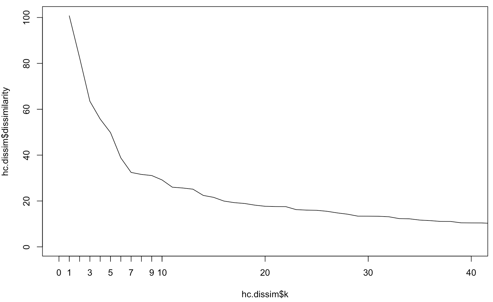

# Customer Segmentation

## Data exploration and scaling
Data on 3,999 customers obtained from the loyalty program of a former airline.

There are six numerical values describing customers as follow:
- **Balance**: Number of miles eligible for award travel
- **BonusTrans**: Number of non-flight bonus transactions in the past 12 months
- **BonusMiles**: Number of miles earned from those transactions
- **FlightTrans**: Number of flight transactions
- **FlightMiles**: Number of miles earned from those transactions
- **DaysSinceEnroll**: Tenure in the program (days)

<p align='center'>

</p>

### Preprocess data
- First, 'center' the data by substracting the mean to each column (mean becomes 0 for each column)
- Then, 'scale' the data by dividing by the standard deviation (standard deviation becomes 1 for each column)

```bash
#step 1: create the pre-processor using preProcess
# normalization for each col: (X_i-mean)/std
pp <- preProcess(airline, method=c("center", "scale"))
class(pp)
pp
pp$mean

#step 2: apply it to our dataset
airline.scaled <- predict(pp, airline)

# Sanity check
# mean is (approximately) 0 for all columns.
colMeans(airline)
colMeans(airline.scaled)
apply(airline.scaled,2,sd)
```

|**Raw**|**Scaled**|
|--|--|
|||
<br/>

## Clustering: K-Means

k-means has a random start (where the centroids are initially randomly located).

```bash
# The kmeans function creates the clusters
# set the number of iterations to k=8
km <- kmeans(airline.scaled, centers = 8, iter.max=100) # centers randomly selected from rows of airline.scaled

class(km) # class: kmeans
names(km)

# cluster centroids. Store this result
km.centroids <- km$centers
km.centroids
# cluster for each point. Store this result.
km.clusters <- km$cluster
km.clusters
# the sum of the squared distances of each observation from its cluster centroid => cluster dissimilarity
km$tot.withinss  # cluster dissimilarity
# the number of observations in each cluster -- table(km$cluster) also works. Store this resul
km.size <- km$size
km.size
```

### Scree plot for k-means

For k means, we literally try many value of k and look at their dissimilarity. Here, test all k from 1 to 100.

```bash
k.data <- data.frame(k = 1:100)
k.data$SS <- sapply(k.data$k, function(k) {
  kmeans(airline.scaled, iter.max=100, k)$tot.withinss
})

# Plot the scree plot.
plot(k.data$k, k.data$SS, type="l")
```


<br />

## Hierarchical Clustering
Compute all-pair euclidian distances between our observations

```bash
d <- dist(airline.scaled) # method = "euclidean"
class(d)

# Creates the Hierarchical clustering
hclust.mod <- hclust(d, method="ward.D2")
# The "method=ward.D2" indicates the criterion to select the pair of clusters to be merged at each iteration

# Now, plot the hierarchy structure (dendrogram)
# labels=F (false) because we do not want to print text
# for each of the 3999 observations
plot(hclust.mod, labels=F, ylab="Dissimilarity", xlab = "", sub = "")
```


### Scree Plot
Create the scree plot: dissimilarity for each k

```bash
hc.dissim <- data.frame(k = seq_along(hclust.mod$height),   # index: 1,2,...,length(hclust.mod$height)
                        dissimilarity = rev(hclust.mod$height)) # reverse elements
head(hc.dissim)

# Scree plot
plot(hc.dissim$k, hc.dissim$dissimilarity, type="l")

# Let's zoom on the smallest k values:
plot(hc.dissim$k, hc.dissim$dissimilarity, type="l", xlim=c(0,40))
axis(side = 1, at = 1:10)
```


To select a "good" k value, pick something that defines the corner / pivot in the L (knee).
```bash
# Improvement in dissimilarity for increasing number of clusters
hc.dissim.dif = head(hc.dissim,-1)-tail(hc.dissim,-1)
head(hc.dissim.dif,10)

# construct the clusters with k=7
h.clusters <- cutree(hclust.mod, 7)
h.clusters

# The *centroid* for a cluster is the mean value of all points in the cluster: 
aggregate(airline.scaled, by=list(h.clusters), mean) # Compute centroids

# *size* of each cluster
table(h.clusters)

# many zeros mean clusters from kmeans and hierarchical "match up"
table(h.clusters, km.clusters)
```

